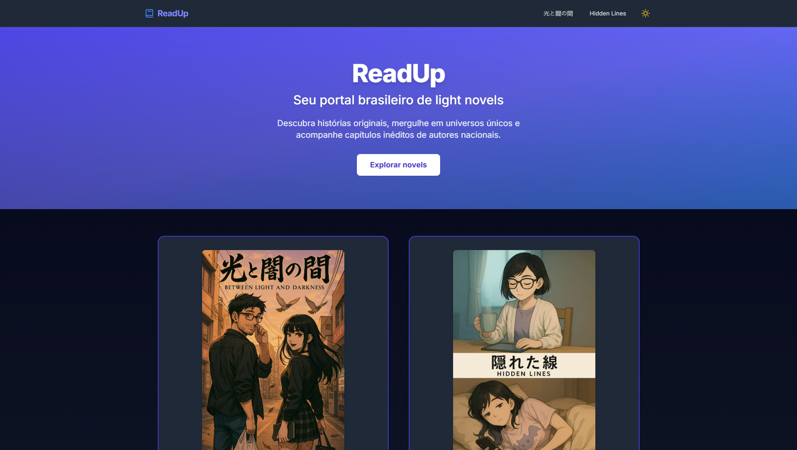

# 📚 ReadUp — leitor de light novel



Leitor simples e confortável para a light novel **“光と闇の間”**, com **navegação por capítulos** e **modo claro/escuro**.

🔗 **Live/Demo:** veja o link em **About → Website** do repositório

🧰 **Stack:** Next.js (App Router) · TypeScript · Tailwind CSS · Framer Motion · next-themes

---

## ✨ Recursos
- 📖 Lista de **capítulos** e navegação
- 🌓 **Tema** claro/escuro
- 📱 Layout **responsivo**
- 🎞️ Microanimações com **Framer Motion**

## 🚀 Como rodar localmente
Requisitos: **Node 18+**

```bash
npm install
npm run dev
# http://localhost:3000

```

## 🛠️ Scripts

- `dev` – desenvolvimento
- `build` – produção
- `start` – servir build (SSR)
- `lint` – lint (se configurado)

## ☁️ Deploy

- **Vercel** recomendado para Next.js (SSR/SSG).
- Ajuste variáveis de ambiente se houver integrações futuras.

## 📄 Licença

MIT — veja `LICENSE`.

## 🤝 Contribuindo

Issues e PRs são bem-vindos! Siga boas práticas de acessibilidade e semântica HTML.
